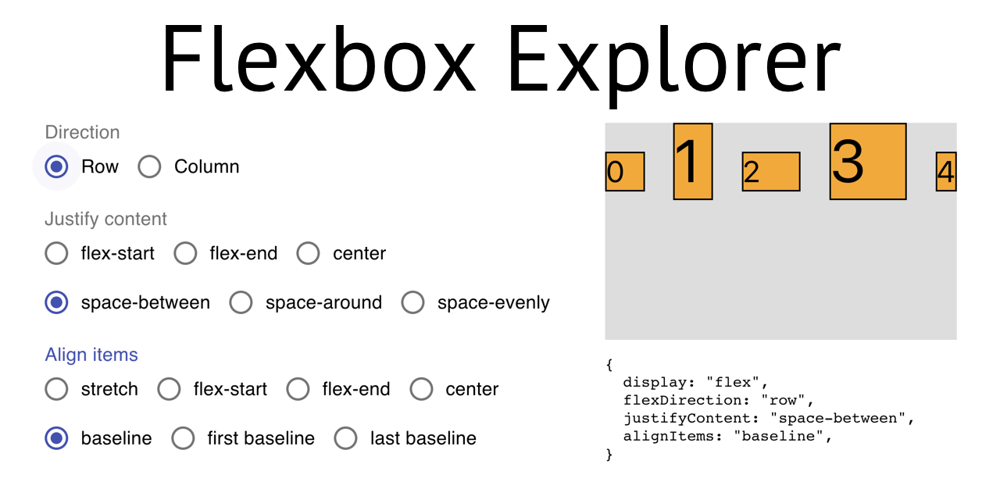

This project is a small React App that allows people who struggle with CSS Flexbox to explorer the options for justifying and aligning things.

Live Demo: [click here](https://flexbox-explorer.mbohlen.de).

## How to use this

1. Click on Row or Column in order to get a flexbox row or flexbox column. You will see a container with some randomly sized boxes as items in it.
1. Select one of the "Justify content" options to define where the items should go on the main axis (start, end, center, whatever).
1. Select one of the "Align items" options to define where the items should be positioned along the cross axis.
1. Look at what happens.
1. When you like the result, copy the piece of code at the bottom right into your React application (the type is `CSSProperties`).
